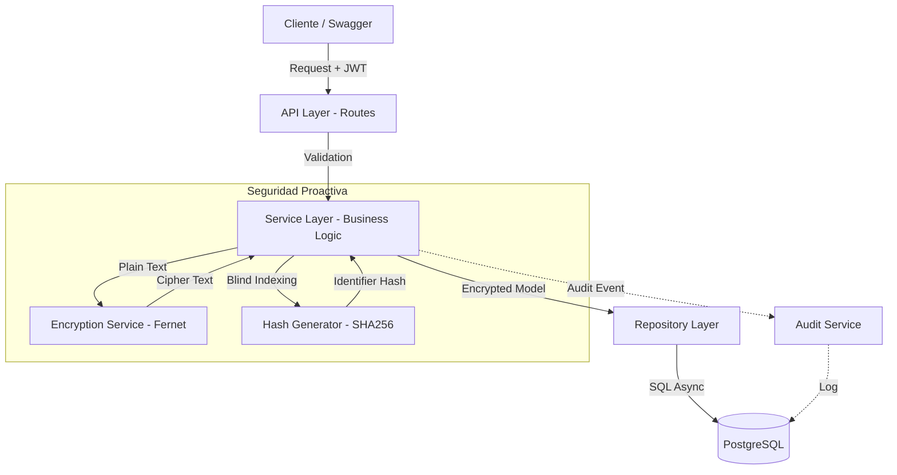

# Taveron Wallet Server 💳🔒

Backend robusto y seguro desarrollado en Python para la gestión de métodos de pago en una billetera digital.

## 🚀 Inicio Rápido

### Requisitos Previos
- Python 3.10 o superior.
- PostgreSQL 16 instalado y en ejecución.

### Instalación
1. **Clonar el repositorio** y entrar a la carpeta.
2. **Crear y activar el entorno virtual**:
   ```powershell
   python -m venv venv
   .\venv\Scripts\activate
   ```
3. **Instalar dependencias**:
   ```powershell
   pip install -r requirements.txt
   ```
4. **Configurar variables de entorno**: Crea un archivo `.env` basado en la configuración actual (DB_URL, JWT_SECRET, ENCRYPTION_KEY).
5. **Ejecutar migraciones**:
   ```powershell
   alembic upgrade head
   ```
6. **Levantar el servidor**:
   ```powershell
   uvicorn app.main:app --reload
   ```

## 🛡 Seguridad y Buenas Prácticas

- **Cifrado Simétrico (AES/Fernet)**: Los datos sensibles (tarjetas/cuentas) se cifran antes de tocar la base de datos.
- **Trazabilidad Total**: Cada creación, eliminación o consulta de datos sensibles genera un registro en `audit_logs` con IP y timestamp.
- **Validación Estricta**: Uso de Pydantic v2 para validar formatos de tarjeta (15-16 dígitos) y CLABE (18 dígitos).
- **Autenticación JWT**: Endpoints protegidos con tokens de acceso de corta duración.
- **Soft Delete**: Los métodos de pago no se borran físicamente, permitiendo recuperación y auditoría histórica.

## 🧪 Pruebas
Para asegurar la integridad del sistema, consulta la [Guía de Pruebas](docs/TESTING.md) o ejecuta:
```powershell
pytest
```

## 📖 Documentación de API
Una vez levantado el servidor, la documentación interactiva está disponible en:
- **Swagger UI**: `http://127.0.0.1:8000/docs`

## 🏗 Arquitectura y Flujo de Datos



El proyecto sigue una **Arquitectura en Capas (Layered Architecture)** para separar responsabilidades y facilitar las pruebas:
- **API/Routes:** Controladores que gestionan las peticiones HTTP.
- **Services:** Capa donde reside la lógica de negocio y reglas de validación.
- **Repositories:** Abstracción para el acceso a la base de datos.
- **Models/Schemas:** Definición de la estructura de datos y validaciones.

---
**Desarrollado como Prueba Técnica para Taveron.**
